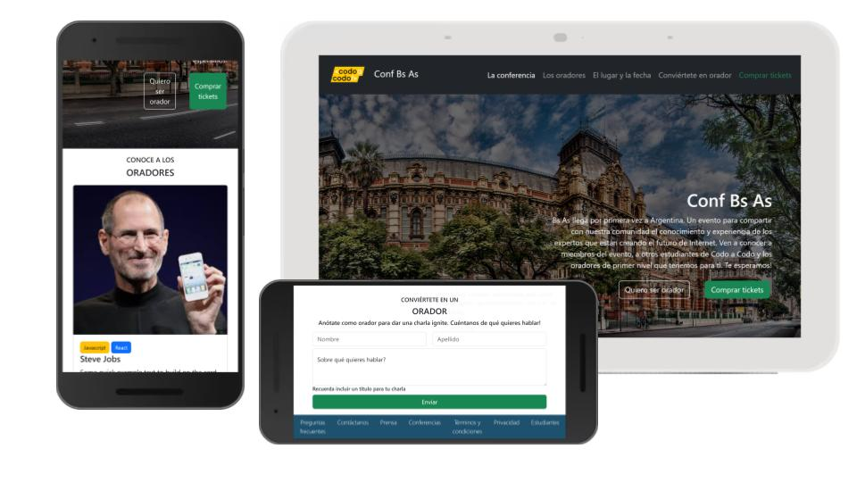
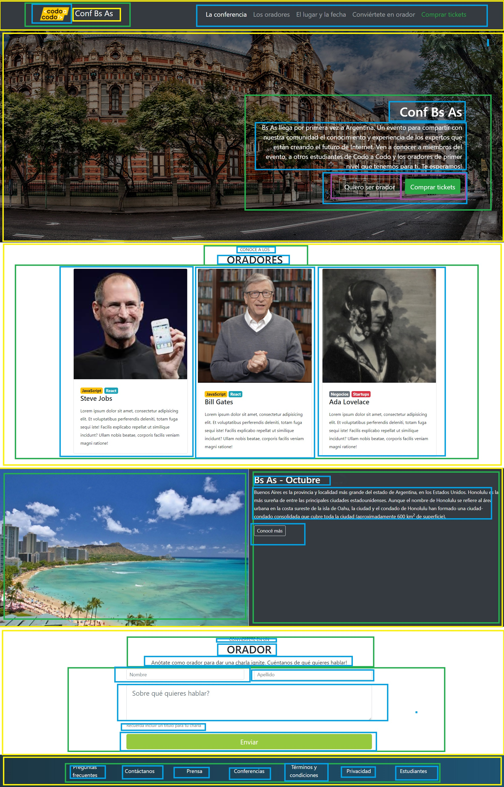

# Codo A Codo - FullStack - Java - Comision 23041
## TPI Frontend
 

## Landing page

`<link>` : <https://23041-full-stack-java.github.io/TPI-Frontend/>

## Codo a Codo - FullStack-JAVA

### Trabajo Práctico Integrador - Frontend

#### Objetivo
Deberán replicar la siguiente página principal con lo visto en clase hasta el momento, se recomienda usar Bootstrap.

#### Tecnologías utilizadas:
- HTML
- CSS
- Bootstrap

